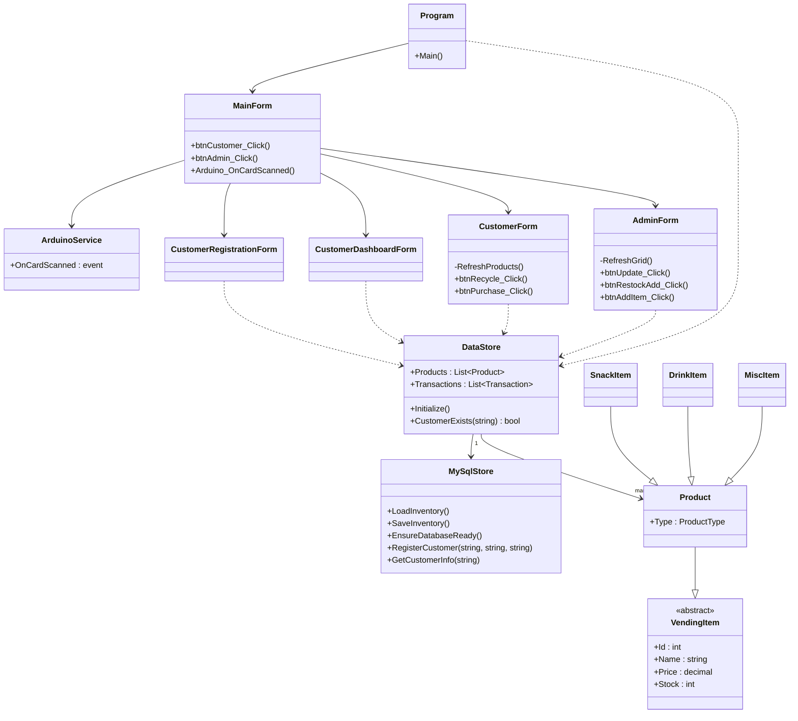

# Class Diagram (Simplified)

```mermaid
classDiagram
    class Program {
        +Main()
    }

    class MainForm {
        +btnCustomer_Click()
        +btnAdmin_Click()
        +Arduino_OnCardScanned()
    }
    
    class ArduinoService {
        +OnCardScanned : event
    }

    class CustomerRegistrationForm
    class CustomerDashboardForm

    class CustomerForm {
        -RefreshProducts()
        +btnRecycle_Click()
        +btnPurchase_Click()
    }

    class AdminForm {
        -RefreshGrid()
        +btnUpdate_Click()
        +btnRestockAdd_Click()
        +btnAddItem_Click()
    }

    class DataStore {
        +Products : List~Product~
        +Transactions : List~Transaction~
        +Initialize()
        +CustomerExists(string) bool
    }

    class MySqlStore {
        +LoadInventory()
        +SaveInventory()
        +EnsureDatabaseReady()
        +RegisterCustomer(string, string, string)
        +GetCustomerInfo(string)
    }

    class VendingItem {
        <<abstract>>
        +Id : int
        +Name : string
        +Price : decimal
        +Stock : int
    }

    class Product {
        +Type : ProductType
    }

    class SnackItem
    class DrinkItem
    class MiscItem

    Program --> MainForm
    Program ..> DataStore

    MainForm --> ArduinoService
    MainForm --> CustomerRegistrationForm
    MainForm --> CustomerDashboardForm
    MainForm --> CustomerForm
    MainForm --> AdminForm

    CustomerRegistrationForm ..> DataStore
    CustomerDashboardForm ..> DataStore
    CustomerForm ..> DataStore
    AdminForm ..> DataStore

    DataStore --> MySqlStore

    Product --|> VendingItem
    SnackItem --|> Product
    DrinkItem --|> Product
    MiscItem --|> Product

    DataStore "1" --> "many" Product
```