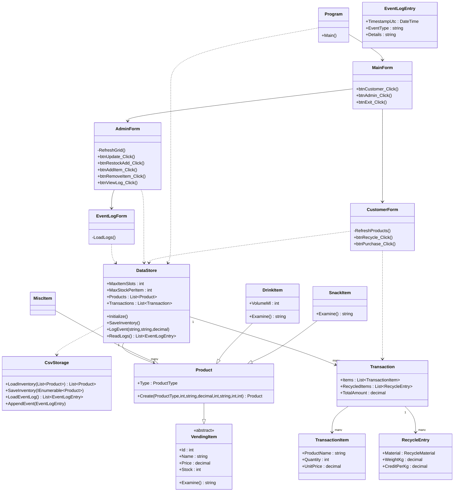

# Class Diagram (Simplified)

```mermaid
classDiagram
    class Program {
        +Main()
    }

    class MainForm {
        +btnCustomer_Click()
        +btnAdmin_Click()
        +btnExit_Click()
    }

    class CustomerForm {
        -RefreshProducts()
        +btnRecycle_Click()
        +btnPurchase_Click()
    }

    class AdminForm {
        -RefreshGrid()
        +btnUpdate_Click()
        +btnRestockAdd_Click()
        +btnAddItem_Click()
        +btnRemoveItem_Click()
        +btnViewLog_Click()
    }

    class EventLogForm {
        -LoadLogs()
    }

    class DataStore {
        +MaxItemSlots : int
        +MaxStockPerItem : int
        +Products : List~Product~
        +Transactions : List~Transaction~
        +Initialize()
        +SaveInventory()
        +LogEvent(string,string,decimal)
        +ReadLogs() List~EventLogEntry~
    }

    class CsvStorage {
        +LoadInventory(List~Product~) List~Product~
        +SaveInventory(IEnumerable~Product~)
        +LoadEventLog() List~EventLogEntry~
        +AppendEvent(EventLogEntry)
    }

    class VendingItem {
        <<abstract>>
        +Id : int
        +Name : string
        +Price : decimal
        +Stock : int
        +Examine() string
    }

    class Product {
        +Type : ProductType
        +Create(ProductType,int,string,decimal,int,string,int,int) Product
    }

    class SnackItem {
        +Examine() string
    }

    class DrinkItem {
        +VolumeMl : int
        +Examine() string
    }

    class MiscItem

    class Transaction {
        +Items : List~TransactionItem~
        +RecycledItems : List~RecycleEntry~
        +TotalAmount : decimal
    }

    class TransactionItem {
        +ProductName : string
        +Quantity : int
        +UnitPrice : decimal
    }

    class RecycleEntry {
        +Material : RecycleMaterial
        +WeightKg : decimal
        +CreditPerKg : decimal
    }

    class EventLogEntry {
        +TimestampUtc : DateTime
        +EventType : string
        +Details : string
    }

    Program --> MainForm
    Program ..> DataStore

    MainForm --> CustomerForm
    MainForm --> AdminForm

    CustomerForm ..> DataStore
    CustomerForm ..> Transaction
    AdminForm ..> DataStore
    AdminForm --> EventLogForm
    EventLogForm ..> DataStore

    DataStore ..> CsvStorage

    Product --|> VendingItem
    SnackItem --|> Product
    DrinkItem --|> Product
    MiscItem --|> Product

    DataStore "1" --> "many" Product
    DataStore "1" --> "many" Transaction
    Transaction "1" --> "many" TransactionItem
    Transaction "1" --> "many" RecycleEntry
```
