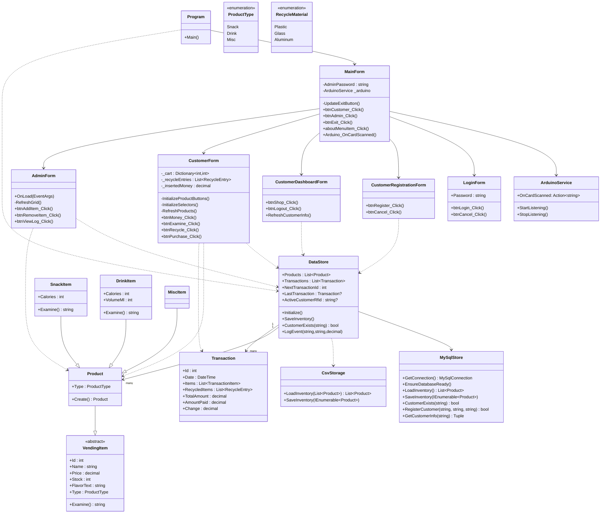

# Class Diagram

```mermaid
classDiagram
    class Program {
        +Main()
    }

    class MainForm {
        -AdminPassword : string
        -ArduinoService _arduino
        -UpdateExitButton()
        +btnCustomer_Click()
        +btnAdmin_Click()
        +btnExit_Click()
        +aboutMenuItem_Click()
        +Arduino_OnCardScanned()
    }

    class ArduinoService {
        +OnCardScanned: Action~string~
        +StartListening()
        +StopListening()
    }

    class CustomerRegistrationForm {
        +btnRegister_Click()
        +btnCancel_Click()
    }

    class CustomerDashboardForm {
        +btnShop_Click()
        +btnLogout_Click()
        +RefreshCustomerInfo()
    }

    class LoginForm {
        +Password : string
        +btnLogin_Click()
        +btnCancel_Click()
    }

    class CustomerForm {
        -_cart : Dictionary~int,int~
        -_recycleEntries : List~RecycleEntry~
        -_insertedMoney : decimal
        -InitializeProductButtons()
        -InitializeSelectors()
        -RefreshProducts()
        +btnMoney_Click()
        +btnExamine_Click()
        +btnRecycle_Click()
        +btnPurchase_Click()
    }

    class AdminForm {
        +OnLoad(EventArgs)
        -RefreshGrid()
        +btnAddItem_Click()
        +btnRemoveItem_Click()
        +btnViewLog_Click()
    }

    class DataStore {
        +Products : List~Product~
        +Transactions : List~Transaction~
        +NextTransactionId : int
        +LastTransaction : Transaction?
        +ActiveCustomerRfid : string?
        +Initialize()
        +SaveInventory()
        +CustomerExists(string) bool
        +LogEvent(string,string,decimal)
    }

    class MySqlStore {
        +GetConnection() MySqlConnection
        +EnsureDatabaseReady()
        +LoadInventory() List~Product~
        +SaveInventory(IEnumerable~Product~)
        +CustomerExists(string) bool
        +RegisterCustomer(string, string, string) bool
        +GetCustomerInfo(string) Tuple
    }

    class CsvStorage {
        +LoadInventory(List~Product~) List~Product~
        +SaveInventory(IEnumerable~Product~)
    }

    class ProductType {
        <<enumeration>>
        Snack
        Drink
        Misc
    }

    class RecycleMaterial {
        <<enumeration>>
        Plastic
        Glass
        Aluminum
    }

    class VendingItem {
        <<abstract>>
        +Id : int
        +Name : string
        +Price : decimal
        +Stock : int
        +FlavorText : string
        +Type : ProductType
        +Examine() string
    }

    class Product {
        +Type : ProductType
        +Create() Product
    }

    class SnackItem {
        +Calories : int
        +Examine() string
    }

    class DrinkItem {
        +Calories : int
        +VolumeMl : int
        +Examine() string
    }

    class MiscItem {
    }

    class Transaction {
        +Id : int
        +Date : DateTime
        +Items : List~TransactionItem~
        +RecycledItems : List~RecycleEntry~
        +TotalAmount : decimal
        +AmountPaid : decimal
        +Change : decimal
    }

    Program --> MainForm
    Program ..> DataStore
    MainForm --> ArduinoService
    MainForm --> LoginForm
    MainForm --> CustomerRegistrationForm
    MainForm --> CustomerDashboardForm
    MainForm --> CustomerForm
    MainForm --> AdminForm

    CustomerRegistrationForm ..> DataStore
    CustomerDashboardForm ..> DataStore
    CustomerForm ..> DataStore
    CustomerForm ..> Product
    CustomerForm ..> Transaction
    AdminForm ..> DataStore
    AdminForm ..> Product

    DataStore --> MySqlStore
    DataStore ..> CsvStorage

    Product --|> VendingItem
    SnackItem --|> Product
    DrinkItem --|> Product
    MiscItem --|> Product

    DataStore "1" --> "many" Product
    DataStore "1" --> "many" Transaction
```