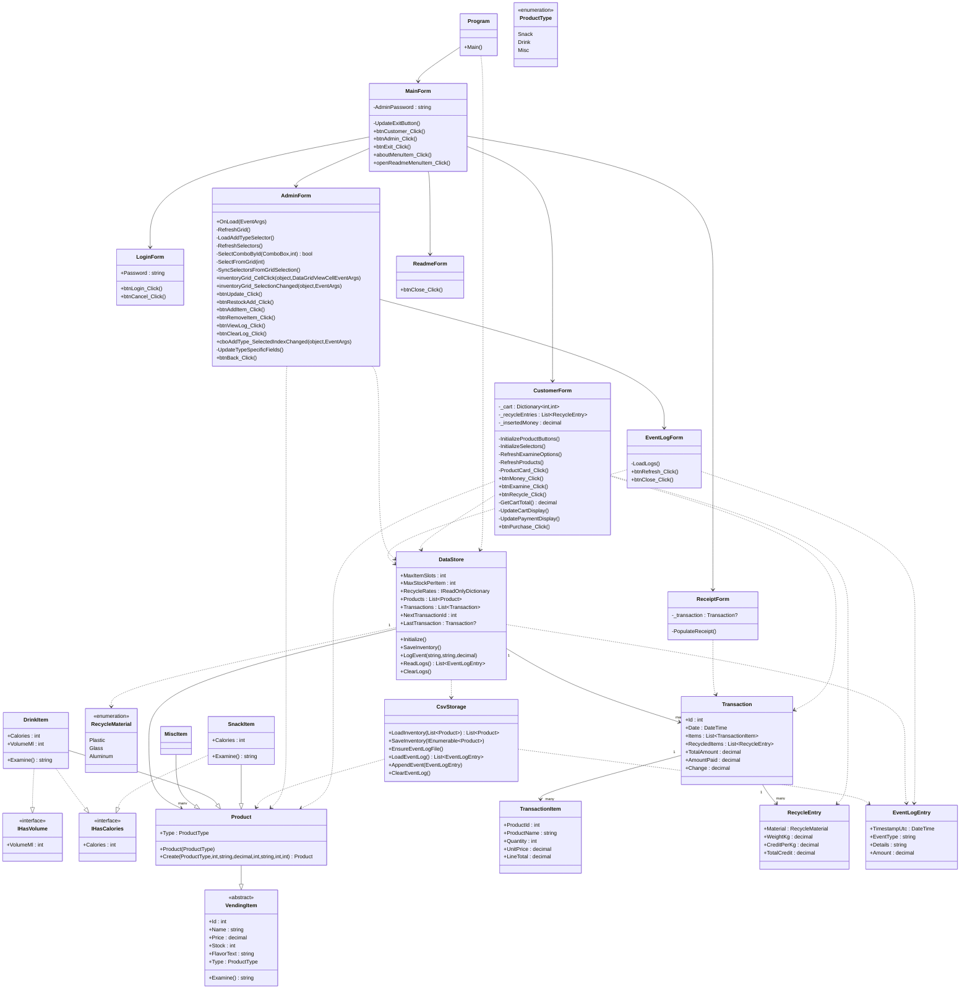

# Class Diagram

```mermaid
classDiagram
    class Program {
        +Main()
    }

    class MainForm {
        -AdminPassword : string
        -UpdateExitButton()
        +btnCustomer_Click()
        +btnAdmin_Click()
        +btnExit_Click()
        +aboutMenuItem_Click()
        +openReadmeMenuItem_Click()
    }

    class LoginForm {
        +Password : string
        +btnLogin_Click()
        +btnCancel_Click()
    }

    class CustomerForm {
        -_cart : Dictionary~int,int~
        -_recycleEntries : List~RecycleEntry~
        -_insertedMoney : decimal
        -InitializeProductButtons()
        -InitializeSelectors()
        -RefreshExamineOptions()
        -RefreshProducts()
        -ProductCard_Click()
        +btnMoney_Click()
        +btnExamine_Click()
        +btnRecycle_Click()
        -GetCartTotal() decimal
        -UpdateCartDisplay()
        -UpdatePaymentDisplay()
        +btnPurchase_Click()
    }

    class AdminForm {
        +OnLoad(EventArgs)
        -RefreshGrid()
        -LoadAddTypeSelector()
        -RefreshSelectors()
        -SelectComboById(ComboBox,int) bool
        -SelectFromGrid(int)
        -SyncSelectorsFromGridSelection()
        +inventoryGrid_CellClick(object,DataGridViewCellEventArgs)
        +inventoryGrid_SelectionChanged(object,EventArgs)
        +btnUpdate_Click()
        +btnRestockAdd_Click()
        +btnAddItem_Click()
        +btnRemoveItem_Click()
        +btnViewLog_Click()
        +btnClearLog_Click()
        +cboAddType_SelectedIndexChanged(object,EventArgs)
        -UpdateTypeSpecificFields()
        +btnBack_Click()
    }

    class EventLogForm {
        -LoadLogs()
        +btnRefresh_Click()
        +btnClose_Click()
    }

    class ReceiptForm {
        -_transaction : Transaction?
        -PopulateReceipt()
    }

    class ReadmeForm {
        +btnClose_Click()
    }

    class DataStore {
        +MaxItemSlots : int
        +MaxStockPerItem : int
        +RecycleRates : IReadOnlyDictionary
        +Products : List~Product~
        +Transactions : List~Transaction~
        +NextTransactionId : int
        +LastTransaction : Transaction?
        +Initialize()
        +SaveInventory()
        +LogEvent(string,string,decimal)
        +ReadLogs() List~EventLogEntry~
        +ClearLogs()
    }

    class CsvStorage {
        +LoadInventory(List~Product~) List~Product~
        +SaveInventory(IEnumerable~Product~)
        +EnsureEventLogFile()
        +LoadEventLog() List~EventLogEntry~
        +AppendEvent(EventLogEntry)
        +ClearEventLog()
    }

    class ProductType {
        <<enumeration>>
        Snack
        Drink
        Misc
    }

    class RecycleMaterial {
        <<enumeration>>
        Plastic
        Glass
        Aluminum
    }

    class IHasVolume {
        <<interface>>
        +VolumeMl : int
    }

    class IHasCalories {
        <<interface>>
        +Calories : int
    }

    class VendingItem {
        <<abstract>>
        +Id : int
        +Name : string
        +Price : decimal
        +Stock : int
        +FlavorText : string
        +Type : ProductType
        +Examine() string
    }

    class Product {
        +Type : ProductType
        +Product(ProductType)
        +Create(ProductType,int,string,decimal,int,string,int,int) Product
    }

    class SnackItem {
        +Calories : int
        +Examine() string
    }

    class DrinkItem {
        +Calories : int
        +VolumeMl : int
        +Examine() string
    }

    class MiscItem {
    }

    class Transaction {
        +Id : int
        +Date : DateTime
        +Items : List~TransactionItem~
        +RecycledItems : List~RecycleEntry~
        +TotalAmount : decimal
        +AmountPaid : decimal
        +Change : decimal
    }

    class TransactionItem {
        +ProductId : int
        +ProductName : string
        +Quantity : int
        +UnitPrice : decimal
        +LineTotal : decimal
    }

    class RecycleEntry {
        +Material : RecycleMaterial
        +WeightKg : decimal
        +CreditPerKg : decimal
        +TotalCredit : decimal
    }

    class EventLogEntry {
        +TimestampUtc : DateTime
        +EventType : string
        +Details : string
        +Amount : decimal
    }

    Program --> MainForm
    Program ..> DataStore
    MainForm --> LoginForm
    MainForm --> CustomerForm
    MainForm --> AdminForm
    MainForm --> ReceiptForm
    MainForm --> ReadmeForm

    CustomerForm ..> DataStore
    CustomerForm ..> Product
    CustomerForm ..> Transaction
    CustomerForm ..> RecycleEntry
    AdminForm ..> DataStore
    AdminForm ..> Product
    AdminForm --> EventLogForm
    EventLogForm ..> DataStore
    EventLogForm ..> EventLogEntry
    ReceiptForm ..> Transaction

    DataStore ..> CsvStorage
    DataStore ..> EventLogEntry
    DataStore ..> RecycleMaterial
    CsvStorage ..> Product
    CsvStorage ..> EventLogEntry

    Product --|> VendingItem
    SnackItem --|> Product
    DrinkItem --|> Product
    MiscItem --|> Product
    SnackItem ..|> IHasCalories
    DrinkItem ..|> IHasCalories
    DrinkItem ..|> IHasVolume

    DataStore "1" --> "many" Product
    DataStore "1" --> "many" Transaction
    Transaction "1" --> "many" TransactionItem
    Transaction "1" --> "many" RecycleEntry
```