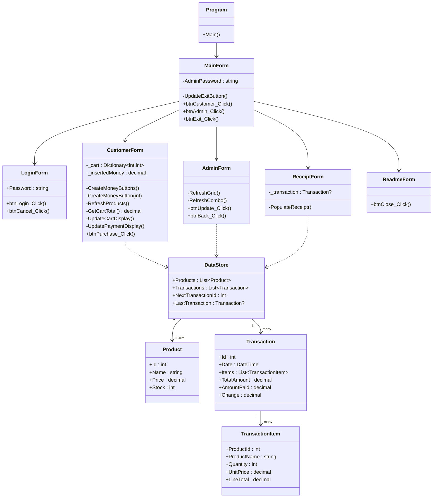

# Class Diagram

```mermaid
classDiagram
    class Program {
        +Main()
    }

    class MainForm {
        -AdminPassword : string
        -UpdateExitButton()
        +btnCustomer_Click()
        +btnAdmin_Click()
        +btnExit_Click()
    }

    class LoginForm {
        +Password : string
        +btnLogin_Click()
        +btnCancel_Click()
    }

    class CustomerForm {
        -_cart : Dictionary~int,int~
        -_insertedMoney : decimal
        -CreateMoneyButtons()
        -CreateMoneyButton(int)
        -RefreshProducts()
        -GetCartTotal() decimal
        -UpdateCartDisplay()
        -UpdatePaymentDisplay()
        +btnPurchase_Click()
    }

    class AdminForm {
        -RefreshGrid()
        -RefreshCombo()
        +btnUpdate_Click()
        +btnBack_Click()
    }

    class ReceiptForm {
        -_transaction : Transaction?
        -PopulateReceipt()
    }

    class ReadmeForm {
        +btnClose_Click()
    }

    class DataStore {
        +Products : List~Product~
        +Transactions : List~Transaction~
        +NextTransactionId : int
        +LastTransaction : Transaction?
    }

    class Product {
        +Id : int
        +Name : string
        +Price : decimal
        +Stock : int
    }

    class Transaction {
        +Id : int
        +Date : DateTime
        +Items : List~TransactionItem~
        +TotalAmount : decimal
        +AmountPaid : decimal
        +Change : decimal
    }

    class TransactionItem {
        +ProductId : int
        +ProductName : string
        +Quantity : int
        +UnitPrice : decimal
        +LineTotal : decimal
    }

    Program --> MainForm
    MainForm --> LoginForm
    MainForm --> CustomerForm
    MainForm --> AdminForm
    MainForm --> ReceiptForm
    MainForm --> ReadmeForm

    CustomerForm ..> DataStore
    AdminForm ..> DataStore
    ReceiptForm ..> DataStore

    DataStore "1" --> "many" Product
    DataStore "1" --> "many" Transaction
    Transaction "1" --> "many" TransactionItem
```