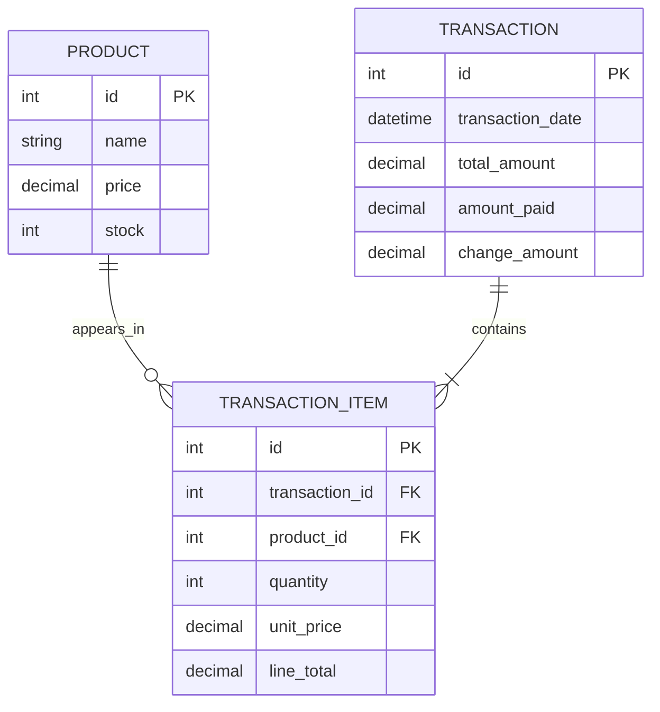

# ERD (Planned for MySQL in Increment 2)

```mermaid
erDiagram
    PRODUCT {
        int id PK
        string name
        decimal price
        int stock
    }

    TRANSACTION {
        int id PK
        datetime transaction_date
        decimal total_amount
        decimal amount_paid
        decimal change_amount
    }

    TRANSACTION_ITEM {
        int id PK
        int transaction_id FK
        int product_id FK
        int quantity
        decimal unit_price
        decimal line_total
    }

    PRODUCT ||--o{ TRANSACTION_ITEM : appears_in
    TRANSACTION ||--|{ TRANSACTION_ITEM : contains
```

## Note

This ERD is for Increment 2 database implementation.
Increment 1 still uses in-memory lists in `DataStore`.
