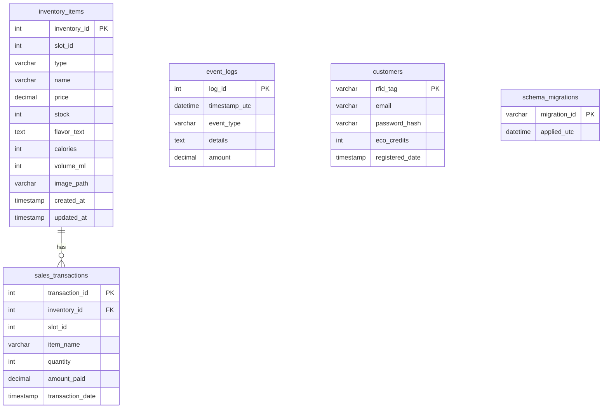

# ERD (MySQL Database)

This ERD represents the current MySQL schema used by the application, reflecting the final implementation.

```mermaid
erDiagram
    inventory_items {
        int inventory_id PK
        int slot_id
        varchar type
        varchar name
        decimal price
        int stock
        text flavor_text
        int calories
        int volume_ml
        varchar image_path
        timestamp created_at
        timestamp updated_at
    }

    sales_transactions {
        int transaction_id PK
        int inventory_id FK
        int slot_id
        varchar item_name
        int quantity
        decimal amount_paid
        timestamp transaction_date
    }

    event_logs {
        int log_id PK
        datetime timestamp_utc
        varchar event_type
        text details
        decimal amount
    }

    customers {
        varchar rfid_tag PK
        varchar email
        varchar password_hash
        int eco_credits
        timestamp registered_date
    }

    schema_migrations {
        varchar migration_id PK
        datetime applied_utc
    }

    inventory_items ||--o{ sales_transactions : has
```