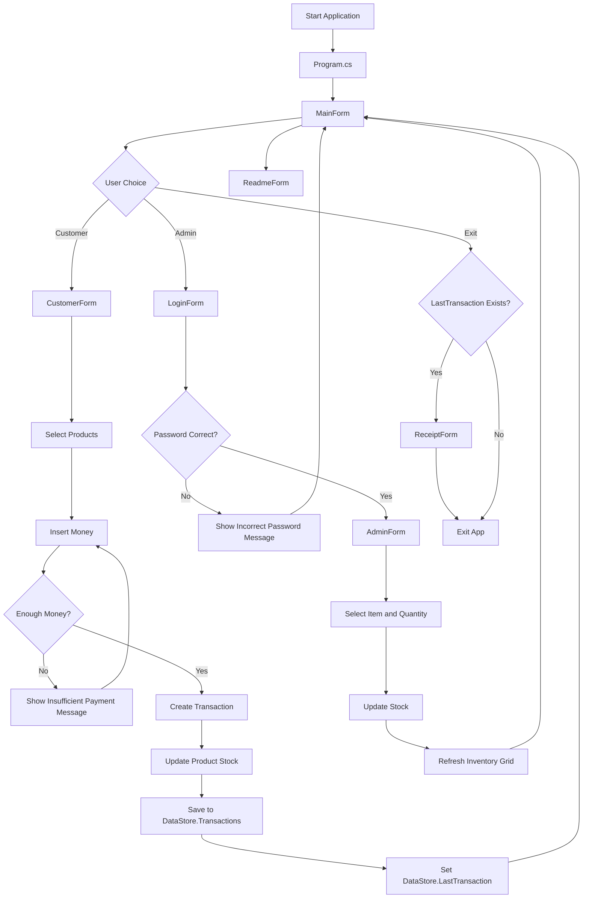

# System Flowchart

```mermaid
flowchart TD
    A[Start Application] --> B[Program.cs]
    B --> C[MainForm]

    C --> D{User Choice}

    D -->|Customer| E[CustomerForm]
    E --> E1[Select Products]
    E1 --> E2[Insert Money]
    E2 --> E3{Enough Money?}
    E3 -->|No| E4[Show Insufficient Payment Message]
    E4 --> E2
    E3 -->|Yes| E5[Create Transaction]
    E5 --> E6[Update Product Stock]
    E6 --> E7[Save to DataStore.Transactions]
    E7 --> E8[Set DataStore.LastTransaction]
    E8 --> C

    D -->|Admin| F[LoginForm]
    F --> F1{Password Correct?}
    F1 -->|No| F2[Show Incorrect Password Message]
    F2 --> C
    F1 -->|Yes| G[AdminForm]
    G --> G1[Select Item and Quantity]
    G1 --> G2[Update Stock]
    G2 --> G3[Refresh Inventory Grid]
    G3 --> C

    D -->|Exit| H{LastTransaction Exists?}
    H -->|Yes| I[ReceiptForm]
    I --> J[Exit App]
    H -->|No| J

    C --> K[ReadmeForm]
```