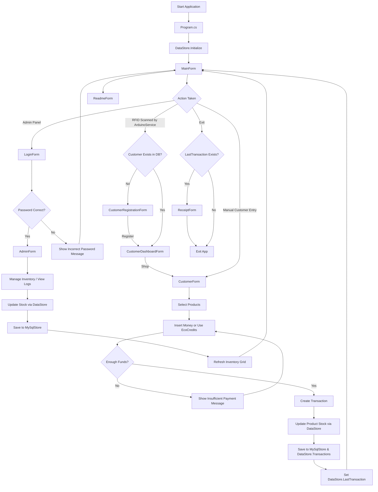

# System Flowchart

```mermaid
flowchart TD
    A[Start Application] --> B[Program.cs]
    B --> C[DataStore.Initialize]
    C --> D[MainForm]

    D --> E{Action Taken}

    E -->|RFID Scanned by ArduinoService| F{Customer Exists in DB?}
    F -->|No| G[CustomerRegistrationForm]
    G -->|Register| H[CustomerDashboardForm]
    F -->|Yes| H

    H -->|Shop| I[CustomerForm]
    I --> I1[Select Products]
    I1 --> I2[Insert Money or Use EcoCredits]
    I2 --> I3{Enough Funds?}
    I3 -->|No| I4[Show Insufficient Payment Message]
    I4 --> I2
    I3 -->|Yes| I5[Create Transaction]
    I5 --> I6[Update Product Stock via DataStore]
    I6 --> I7[Save to MySqlStore & DataStore.Transactions]
    I7 --> I8[Set DataStore.LastTransaction]
    I8 --> D

    E -->|Manual Customer Entry| I

    E -->|Admin Panel| J[LoginForm]
    J --> J1{Password Correct?}
    J1 -->|No| J2[Show Incorrect Password Message]
    J2 --> D
    J1 -->|Yes| K[AdminForm]
    K --> K1[Manage Inventory / View Logs]
    K1 --> K2[Update Stock via DataStore]
    K2 --> K3[Save to MySqlStore]
    K3 --> K4[Refresh Inventory Grid]
    K4 --> D

    E -->|Exit| L{LastTransaction Exists?}
    L -->|Yes| M[ReceiptForm]
    M --> N[Exit App]
    L -->|No| N

    D --> O[ReadmeForm]
```